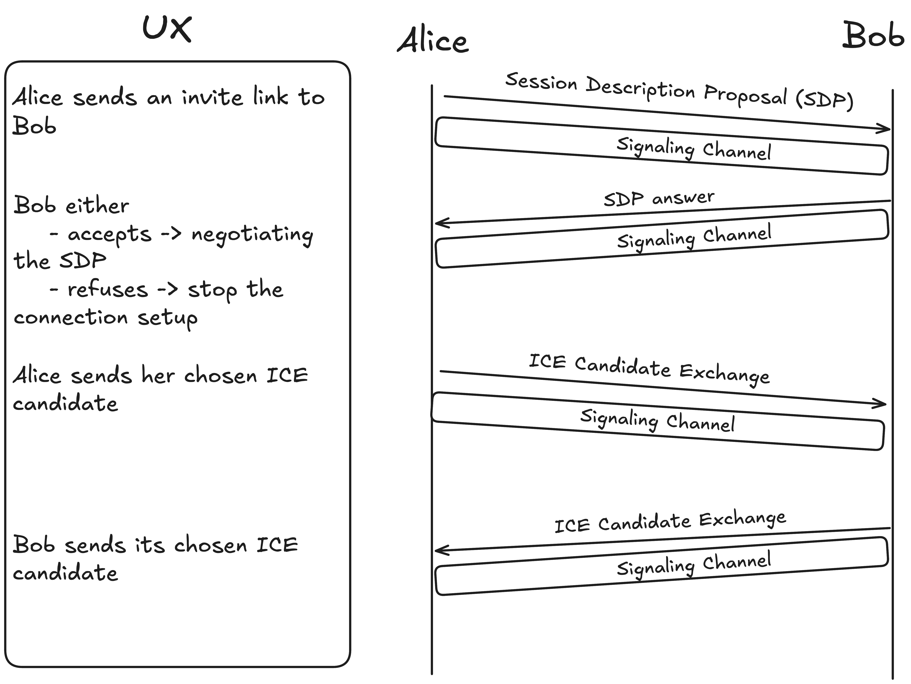

# Navigators Season 2: Growth Grants Proposal

## Title
z2zlib: A Formalization and TypeScript API for P2P State Channels on Mina Protocol

## Project Background
The Mina Protocol offers unique capabilities for zero-knowledge proofs and recursive proving, opening new possibilities for scalable and privacy-preserving decentralized applications. However, the current paradigm of interaction with smart contracts for every state transition introduces unnecessary delays and inefficiencies, particularly in multi-actor applications like games or complex DeFi protocols.

This project, z2zlib, builds upon a hackathon project where I developed a dice betting game. The initial version required interactions with a smart contract for every game state transition, highlighting the limitations of this approach in terms of user experience and efficiency.

z2zlib aims to leverage Mina's infinite recursive proving capabilities to develop a peer-to-peer state channel infrastructure. This library will enable developers to build decentralized applications where actors can interact in a zero-trust setup, peer-to-peer, with optional dispute settlement using zkApp smart contracts.

## Proposal Overview

### Problem
Traditional multi-actor decentralized applications on Mina often rely on smart contracts to handle state changes. This approach enforces a general consensus on state transitions, inducing considerable delay and reducing the overall efficiency and user experience of applications.

### Solution
z2zlib proposes a comprehensive solution comprising:

1. Standardization of an off-chain p2p state channel to handle state transitions, utilizing Mina's unique constant-size recursive proving capability.
2. Development of a p2p state channel library, abstracting away the network stack for p2p proof exchange.
3. Implementation of three example applications showcasing the library's versatility:
   - A multiplayer game
   - A p2p DeFi protocol
   - A B2B zero-knowledge use case, such as a supply chain application
4. Creation of detailed documentation to facilitate adoption and integration by developers.

### Impact
z2zlib will significantly enhance the Mina ecosystem by:
- Improving the infrastructure for developing multi-actor, turn-based applications
- Enabling Mina developers to create zkApps with superior user experience
- Increasing efficiency in application development through abstraction and formalization
- Demonstrating the power and flexibility of Mina's recursive proving capabilities
- Potentially attracting more developers to the Mina ecosystem due to improved tooling

### Audience
The primary audience for z2zlib includes:
- Mina Protocol developers
- Researchers and enthusiasts in the field of zero-knowledge proofs and state channels
- Companies looking to implement zero-knowledge p2p solutions in their business processes

## Architecture & Design

### High-Level Architecture

z2zlib is designed as a modular, layered system comprising several key components:

1. Network Stack (powered by libp2p.js)
2. State Channel Management
3. Zero-Knowledge Proof Generation and Verification
4. Smart Contract Interface
5. Application Layer

#### 1. Network Stack

The network stack, built on libp2p.js, handles peer discovery, connection establishment, and data transfer between peers. It consists of two main components:

a) Connection Setup:
- Utilizes a hole-punching protocol for NAT traversal
- Supports two modes of operation:
  1. Decentralized: Uses a network of incentivized relay nodes
  2. Centralized: Employs an ICE (Interactive Connectivity Establishment) server

b) Proof Exchange:
- Implements WebRTC as the transport layer for efficient, peer-to-peer communication
- Ensures secure and reliable transfer of state proofs between participants

#### 2. State Channel Management

This component is responsible for:
- Initializing and closing state channels
- Managing state transitions within the channel
- Handling disputes and channel settlement

#### 3. Zero-Knowledge Proof Generation and Verification

Leveraging Mina's o1js library, this module:
- Generates zero-knowledge proofs for state transitions
- Verifies incoming proofs from other participants
- Manages the recursive proof structure unique to Mina

#### 4. Smart Contract Interface

This layer provides an abstraction for interacting with on-chain smart contracts, used for:
- Channel opening and closing
- Dispute resolution
- Final state settlement

#### 5. Application Layer

The topmost layer where developers can build their applications using z2zlib. It provides:
- High-level APIs for common operations
- Customizable state machines for application-specific logic
- Event handlers for various channel and state-related events

### Detailed Design

#### Connection Setup

The connection setup process follows these steps:

1. Alice generates a unique session ID and an invite link containing this ID.
2. Alice sends the invite link to Bob through an out-of-band channel (e.g., email, messaging app).
3. Bob opens the invite link, triggering the connection process.
4. Alice and Bob exchange Session Description Proposal (SDP) information through a signaling channel.
5. Both parties exchange ICE candidates that were selected through an ICE server to establish a direct peer-to-peer connection.

 

 

#### Proof Exchange

Once the connection is established, peers can exchange proofs following this flow:

1. Alice generates a state transition and corresponding zero-knowledge proof.
2. Alice sends the proof to Bob over the established WebRTC channel.
3. Bob verifies the received proof.
4. If valid, Bob updates his local state and can then generate the next state transition.
5. The process repeats for each state change in the application.

 

 

#### Peer Discovery and Channel Setup

1. Peer Discovery:
   - Each peer is assigned a unique peerID for each session.
   - The library maintains a Distributed Hash Table (DHT) for peer discovery.
   - Peers can also be discovered through centralized rendezvous points if required.

2. Channel Setup:
   - Peers agree on initial state and channel parameters.
   - A smart contract is optionally deployed on-chain to handle potential disputes.
   - Both parties lock collateral (if required) in the smart contract.
   - The channel is now open for off-chain state-changes.

#### State Management

z2zlib provides a flexible state management system:

1. State Machine Abstraction:
   - Developers define their application's state machine using provided interfaces.
   - The library ensures that all state transitions adhere to the defined rules.

2. Proof Generation:
   - For each state transition, a zero-knowledge proof is generated using o1js.
   - The proof demonstrates the validity of the transition without revealing the actual state.

3. Recursive Proofs:
   - z2zlib leverages Mina's recursive proving capability to maintain a constant-size proof of the entire state history.

4. Dispute Resolution:
   - If a dispute occurs, the latest valid state proof can be submitted to the on-chain smart contract.
   - The contract verifies the proof and resolves the dispute accordingly.

### Vision

The long-term vision for z2zlib is to become a cornerstone in scaling zkApps on Mina Protocol without compromising decentralization. We envision:

1. A thriving ecosystem of scalable, multi-actor applications built on Mina.
2. Integration with other layer-2 scaling solutions to provide a comprehensive scaling toolkit.
3. Adoption of z2zlib patterns in other blockchain ecosystems, showcasing Mina's innovative approach.
4. Continuous research and improvement of the state channel model, potentially leading to academic publications and industry standards.

### Production Timeline

I aim to have a production-ready version of z2zlib within three months from the project's start date. This timeline includes development, testing, documentation, and the creation of example applications.

## Budget & Milestones

### Deliverables

1. Research paper specifying state channels for the Mina Protocol
2. z2zlib TypeScript library
3. Comprehensive documentation and API reference
4. Three example applications:
   - Multiplayer game
   - P2P DeFi protocol
   - B2B supply chain solution

### Mid-Point Milestones (1.5 months)

1. Complete research paper draft
2. Functional prototype of z2zlib with basic features
3. Preliminary documentation
4. Proof-of-concept for one example application

### Project Timeline

3 months

### Budget Requested

100,000 MINA

### Budget Breakdown

- 10,000 MINA: Initial research and planning
- 20,000 MINA: Research paper formalizing the state channel concept for Mina
- 50,000 MINA: Development of the z2zlib library
- 10,000 MINA: Comprehensive documentation and tutorials
- 10,000 MINA: Development of three example applications

### Wallet Address

B62qpc15dgfgxyJNSeETCvB7Pf16cgBL7z7oNML45vzgyZCQAwTygm9

## Team Info

### Proposer GitHub

https://github.com/YofiY

### Proposer Experience

- EPFL graduate pursuing a master's degree in Theoretical Computer Science at ETH Zurich
- Previous research experience in Graph Machine Learning
- Currently focused on Zero-Knowledge Proofs and their applications

### Team Members

Yofi (sole developer for this project)

### Achievements

1. 2nd place in the Mina track at Lambda Hack Week in Brussels, building the ZK Dice Game
   - GitHub: https://github.com/YofiY/zk-dice-roll
2. 3rd place in the general track of ZkHack Montréal, developing a proof-of-location app
   - GitHub: https://github.com/remicolin/zalileo

## Risks & Mitigations

### Technical Risks

1. Proof Generation Time:
   - Risk: Complex state transitions may require significant time to generate proofs, impacting user experience.
   - Mitigation: Optimize proof generation algorithms and implement parallel processing where possible. Consider using simplified state representations for frequent updates.

2. Network Reliability:
   - Risk: P2P connections may be unstable, leading to interrupted sessions.
   - Mitigation: Implement robust reconnection mechanisms and state recovery protocols. Consider optional centralized fallback for critical applications.

### State Channel Specific Risks

1. Liveness:
   - Risk: Connection drops between peers may halt the application state.
   - Mitigation: Implement timeouts and allow for unilateral channel closure after a predefined period of inactivity. Provide options for state recovery through on-chain mechanisms.

2. Data Availability:
   - Risk: Loss of local data (e.g., due to hardware failure) may result in loss of funds or application state.
   - Mitigation: Implement periodic state backups and allow for state reconstruction from on-chain information and counterparty data.

3. Griefing Attacks:
   - Risk: Malicious actors may force frequent on-chain settlements to increase costs for honest participants.
   - Mitigation: Implement reputation systems and economic disincentives for unnecessary on-chain settlements. Design the dispute resolution mechanism to penalize clearly malicious behavior.

### Mitigation Strategies

1. Thorough Specification: Develop a comprehensive specification for the settlement process, covering all edge cases and potential attack vectors.

2. Formal Verification: Employ formal verification techniques on critical components of the library and smart contracts to ensure correctness.

3. Extensive Testing: Implement a rigorous testing suite, including unit tests, integration tests, and simulated attack scenarios.

4. Gradual Rollout: Begin with lower-stakes applications and gradually increase complexity and value at risk as the system proves its reliability.

5. Community Audits: Engage the Mina developer community in reviewing and auditing the codebase before major releases.

6. Continuous Monitoring: Implement logging and monitoring systems to detect and respond to potential issues in real-time during the initial deployment phases.

By addressing these risks and implementing strong mitigation strategies, we aim to create a robust and reliable state channel infrastructure for the Mina ecosystem.

